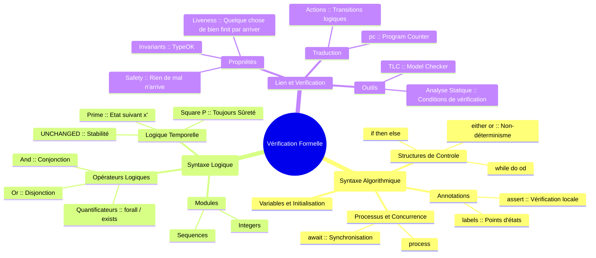

**Requirements :** pour les flashcard, utiliser obsidian avec le comunity package "Spaced repetition" et activer dans les configue toutes lacartes (trous, gras etc...).
Peut-être le mettre à la racine pour éviter les flashcard de tout vos autres fichiers (créees involontairement.).

Voici un résumé exhaustif, structuré et pédagogique des notions extraites de l'ensemble des documents fournis (cours, travaux dirigés, travaux pratiques et annales d'examens). Ce cours, intitulé **MALG** (Modèles et Algorithmes) ou **MOVEX** (Modélisation, Vérification et Expérimentations), couvre les fondements mathématiques et les outils pratiques pour la vérification formelle de logiciels.

---

# Synthèse du Cours : Modélisation, Vérification et Expérimentations

## I. Fondements Théoriques : Logique et Systèmes Formels

Cette partie pose les bases mathématiques nécessaires pour raisonner rigoureusement sur les programmes.

### 1. Logique Propositionnelle et Calcul des Séquents
Le cours débute par la formalisation du raisonnement.
* **Syntaxe et Sémantique :** Définition des formules propositionnelles (variables, connecteurs $\wedge, \vee, \Rightarrow, \neg$). La sémantique est définie par des **valuations** (fonctions de vérité).
* **Tautologie et Satisfaisabilité :** Une formule est une tautologie si elle est vraie pour toute valuation ($\models \phi$). Elle est satisfaisable s'il existe au moins un modèle.
* **Calcul des Séquents (LK de Gentzen) :** C'est un système de déduction formelle. Un séquent s'écrit $\Gamma \rightarrow \Delta$ (si toutes les formules de $\Gamma$ sont vraies, alors au moins une de $\Delta$ est vraie).
    * **Règles :** Le cours détaille les règles structurelles (affaiblissement, contraction, permutation, coupure) et les règles opératoires (introduction des connecteurs à gauche et à droite).
* **Cohérence et Complétude :** Le calcul propositionnel est cohérent (ce qui est prouvé est vrai) et complet (tout ce qui est vrai est prouvable). Il est également **décidable**.

### 2. Logique du Premier Ordre (Calcul des Prédicats)
Extension de la logique propositionnelle pour inclure des variables, des fonctions, des relations et des quantificateurs ($\forall, \exists$).
* **Termes et Formules :** Distinction entre termes (objets du domaine) et formules (vérité). Notion de variable libre vs liée.
* **Interprétation et Modèles :** Une interprétation $I$ fournit un domaine $D$ et donne un sens aux symboles. La validité dépend de l'interprétation.
* **Modèles de Herbrand :** Importants pour la résolution mécanique, où le domaine est l'ensemble des termes eux-mêmes.
* **Indécidabilité :** Contrairement au calcul propositionnel, la logique du premier ordre est indécidable (Théorème de Church/Turing).

### 3. Théorie de la Résolution
Une méthode algorithmique pour prouver la satisfaisabilité (ou réfuter la non-satisfaisabilité) d'une formule.
* **Forme Clausale :** Transformation de formules en conjonction de clauses (disjonction de littéraux).
* **Règle de Résolution :** Règle d'inférence unique qui, appliquée itérativement, permet de dériver la clause vide (contradiction) si l'ensemble de clauses est insatisfaisable.
* **Unification :** Nécessaire dans le premier ordre pour rendre deux termes identiques avant d'appliquer la résolution (calcul du Plus Grand Unificateur - PGU).

### 4. Théorie du Point Fixe et Treillis
Essentielle pour la sémantique des boucles et l'analyse statique.
* **Treillis Complets :** Ensembles ordonnés où toute partie admet une borne supérieure et inférieure. Exemple : $(\mathcal{P}(\Sigma), \subseteq)$.
* **Théorème de Knaster-Tarski :** Toute fonction monotone sur un treillis complet admet un plus petit point fixe ($\mu f$) et un plus grand point fixe ($\nu f$).
    * **Application :** L'ensemble des états accessibles d'un programme est le plus petit point fixe de la fonction "état initial + transition".
* **Interprétation Abstraite et Connexion de Galois :** Technique pour analyser des programmes en approximant leur comportement. On définit deux treillis (Concret $L$ et Abstrait $L'$) reliés par deux fonctions :
    * $\alpha$ (Abstraction) : du concret vers l'abstrait.
    * $\gamma$ (Concrétisation) : de l'abstrait vers le concret.
    * La paire $(\alpha, \gamma)$ forme une **Connexion de Galois** si $\alpha(x) \sqsubseteq' y \iff x \sqsubseteq \gamma(y)$.
    * *Exemples vus en cours/Exams :* Abstraction par signes (pos, neg, zero) ou par intervalles.

---

## II. Vérification de Programmes : De la Théorie à la Pratique

Cette partie fait le lien entre la logique et le code (C ou algorithmes).

### 1. Systèmes de Transitions
Un programme est modélisé comme un système de transitions $(S, Init, Next)$ où $S$ est l'espace d'états, $Init$ les états initiaux, et $Next$ la relation de transition.
* **Trace :** Suite d'états $s_0 \to s_1 \to s_2 \dots$ engendrée par le système.

### 2. Propriétés de Sûreté (Safety) et Invariants
* **Sûreté :** "Rien de mauvais n'arrive". Une propriété $P$ est une propriété de sûreté si elle est vraie pour tous les états accessibles.
* **Invariant Inductif ($I$) :** Pour prouver qu'une propriété $P$ est toujours vraie, on cherche un invariant $I$ tel que :
    1.  $Init \Rightarrow I$ (Vrai au début)
    2.  $I \wedge Next \Rightarrow I'$ (Préservé par chaque transition)
    3.  $I \Rightarrow P$ (Implique la propriété désirée).

### 3. Logique de Hoare et Calcul WP (Weakest Precondition)
Pour vérifier des programmes impératifs structurés.
* **Triplet de Hoare :** $\{P\} S \{Q\}$ signifie "Si $P$ est vrai avant $S$, et si $S$ termine, alors $Q$ est vrai après".
* **Calcul WP (Dijkstra) :** $WP(S, Q)$ est la plus faible précondition pour que $S$ termine dans un état satisfaisant $Q$.
    * La vérification consiste à prouver : $Pre \Rightarrow WP(S, Post)$.
    * *Affectation :* $WP(x:=E, Q) = Q[x \leftarrow E]$ (substitution).
    * *Séquence :* $WP(S1;S2, Q) = WP(S1, WP(S2, Q))$.
    * *Conditionnelle :* $WP(\text{if } B \text{ then } S1 \text{ else } S2, Q) = (B \Rightarrow WP(S1, Q)) \wedge (\neg B \Rightarrow WP(S2, Q))$.
    * *Boucle :* Nécessite un **Invariant de boucle** fourni par l'utilisateur pour rendre le calcul décidable.

### 4. Contrats et Frama-C (ACSL)
Application pratique sur le langage C.
* **Design by Contract :** Utilisation de clauses `requires` (précondition) et `ensures` (postcondition).
* **ACSL (ANSI/ISO C Specification Language) :** Langage d'annotation pour C utilisé par Frama-C.
    * `assigns` : spécifie quelles variables peuvent être modifiées (clause de frame).
    * `\old(x)` ou `\at(x, Pre)` : valeur de x avant l'exécution de la fonction.
    * `loop invariant` et `loop variant` (pour la terminaison).
* **Vérification :** L'outil Frama-C (plugin WP) génère des obligations de preuve (VC) envoyées à des solveurs (Z3, Alt-Ergo).
* **RTE (Run Time Errors) :** Vérification de l'absence de débordements (overflow), division par zéro, etc..

---

## III. Méthode Pratique : TLA+ et PlusCal

TLA+ (Temporal Logic of Actions) est utilisé pour modéliser des systèmes concurrents/distribués. PlusCal est un langage algorithmique qui se traduit en TLA+.

### 1. Concepts TLA+
* **Variables et Constantes :** Déclarés dans le module (`VARIABLES`, `CONSTANTS`).
* **État :** Une assignation de valeurs aux variables.
* **Action :** Une formule logique reliant l'état courant (variables non primées, ex: $x$) et l'état suivant (variables primées, ex: $x'$). Exemple: $x' = x + 1$.
* **Spécification (`Spec`) :** $Init \wedge \Box [Next]_{vars}$ (État initial ET toujours une transition Next ou rien ne change).

### 2. Méthode Pratique avec PlusCal (Incrémentale)

Voici comment utiliser PlusCal/TLA+ du plus simple au plus complexe, basé sur les TD/TP.

#### Niveau 1 : Algorithme séquentiel simple (Affectation)
*Objectif :* Modéliser un calcul simple sans boucle.
*Exemple :* Échange de variables ou calcul arithmétique simple.

1.  **Écriture PlusCal :**
    ```tla
    --algorithm SimpleCalc {
      variables x = 10, y = 20, z = 0;
      {
        z := x + y;
        assert z = 30; (* Vérification ponctuelle *)
      }
    }
    ```
2.  **Traduction :** Le Toolbox traduit ceci en TLA+ (création de la variable `pc` pour le program counter).
3.  **Vérification :** Lancer TLC (le model checker). Il vérifie l'assertion et l'absence de deadlock (si configuré).

#### Niveau 2 : Structures conditionnelles et Invariants (Max)
*Objectif :* Calculer le max de deux nombres.
*Notion clé :* Correction partielle (le résultat final est correct).

1.  **Modélisation :**
    ```tla
    --algorithm Max {
      variables x \in 1..100, y \in 1..100, z = 0; (* Non-déterminisme initial *)
      {
        if (x > y) { z := x } else { z := y };
      }
    }
    ```
2.  **Propriété TLA+ à vérifier :**
    Dans le bloc `define` ou après la traduction :
    `Correctness == pc = "Done" => z = IF x > y THEN x ELSE y`
3.  **Vérification :** Ajouter `Correctness` dans le champ "Properties" ou "Invariants" du modèle TLC.

#### Niveau 3 : Boucles et Invariants Inductifs (Multiplication/Somme)
*Objectif :* Algorithme avec boucle `while`.
*Notion clé :* L'invariant de boucle est crucial pour comprendre l'état à chaque étape `pc`.

1.  **Modélisation (Somme des n entiers) :**
    ```tla
    --algorithm Sum {
      variables n = 5, k = 0, ps = 0;
      {
        loop: while (k < n) {
          k := k + 1;
          ps := ps + k;
        }
      }
    }
    ```
2.  **Définition de l'Invariant :** Il doit être vrai à chaque pas.
    `Inv == (pc = "loop" => ps = (k * (k+1)) \div 2)`
3.  **Vérification :** TLC vérifie que `Inv` est vrai dans tous les états accessibles.

#### Niveau 4 : Algorithmes Complexes (Fonction 91 de McCarthy)
*Objectif :* Modéliser un flux de contrôle complexe ou récursif simulé.

1.  **Approche :** Modéliser la pile d'appels explicitement ou utiliser une structure itérative complexe.
    *Exemple simplifié (Itératif):*
    ```tla
    --algorithm McCarthy91 {
      variables x = X0, c = 1; (* c = compteur de récursion *)
      {
        while (c > 0) {
          if (x > 100) {
            x := x - 10;
            c := c - 1;
          } else {
            x := x + 11;
            c := c + 1;
          }
        }
      }
    }
    ```
2.  **Propriété :** `Termination == <>(pc = "Done" /\ x = 91)` (pour $X0 \le 100$).

### 3. Lien Théorie-Pratique (via les Annales/TD)

* **PGCD (TD1, Exercice 1) :**
    * *Théorie :* Invariant de boucle $pgcd(x,y) = pgcd(x_0, y_0)$.
    * *Pratique (TLA+) :* On définit `Next == (x > y /\ x' = x - y) \/ (y > x /\ y' = y - x)`. On vérifie que le PGCD reste constant à chaque étape.
* **Racine Carrée (TD3, Exercice 8) :**
    * *Théorie :* Utilisation de variables fantômes (ghost variables) ou logique pour maintenir $y_2 = (y_1+1)^2$.
    * *Pratique :* Traduction directe des affectations multiples en PlusCal `(y1, y2) := (y1+1, y2+...)`. Vérification que $z^2 \le x < (z+1)^2$ à la fin.
* **Interprétation Abstraite (Annales) :**
    * *Lien :* Les exercices demandent de calculer $\alpha(\{n | \dots\})$ ou $pos +_a neg$.
    * *Pratique :* Cela correspond à vérifier si un programme TLA+ ou C ne viole pas des bornes (ex: division par zéro) sans exécuter toutes les valeurs, mais en raisonnant sur des ensembles (Abstract Domains).

---

## Ce qui manque (et prompt pour compléter)

Le corpus est très riche sur la logique classique, Hoare, et les bases de TLA+/Frama-C. Cependant, certains détails spécifiques aux outils pourraient être approfondis pour une maîtrise totale :
1.  **Détails syntaxiques avancés d'ACSL :** Comportements (`behaviors`), séparation des cas (`disjoint`, `complete`).
2.  **Raffinement (Refinement) en Event-B :** Bien que cité comme mot-clé, le processus de raffinement (glueing invariant) est peu détaillé dans les extraits par rapport à TLA+.
3.  **Liveness en TLA+ :** Le résumé se concentre sur la *Safety*. La *Liveness* (WF, SF - Weak/Strong Fairness) est mentionnée mais moins détaillée dans les exemples pratiques.

**Prompt pour compléter :**
*"Peux-tu détailler les mécanismes de raffinement en Event-B (invariants de collage) et la syntaxe avancée des contrats ACSL (comportements, `assumes`) ? De plus, fournis des exemples concrets de propriétés de vivacité (Liveness) en TLA+ avec les conditions d'équité associées (WF/SF)."*


# Synthèse Comparative PlusCal et TLA+

Cette synthèse détaille les syntaxes de **PlusCal** et **TLA+**, leurs fonctionnalités, et les équivalences entre ces deux mondes : l'un algorithmique (proche de la programmation) et l'autre logique (fondé sur les mathématiques).

## I. Syntaxe PlusCal : L'approche Algorithmique
PlusCal est utilisé pour décrire des algorithmes de manière structurée. Il est ensuite traduit en TLA+ pour la vérification par le model-checker TLC.

| Syntaxe | Utilité / Fonction | Exemple |
| :--- | :--- | :--- |
| `variables` | Déclare les variables globales et leurs valeurs initiales. | `variables x = 10, y \in 1..10;` |
| `:=` | Affectation simple d'une valeur à une variable. | `x := x + 1;` |
| `(y1, y2) := (v1, v2)` | **Affectation multiple** : les deux variables sont mises à jour simultanément (atomiquement). | `(Y1, Y2) := (0, 1);` |
| `if ... then ... else` | Structure de contrôle conditionnelle classique. | `if X < Y then Z := Y else Z := X;` |
| `while ... do ... od` | Boucle itérative avec condition d'arrêt. | `while Y2 <= X do ... od;` |
| `process` | Définit une unité d'exécution (pour les systèmes concurrents). | `process MyProc = 1 ...` |
| `assert` | Vérifie qu'une propriété est vraie à un point précis du code. | `assert x > 0;` |
| `either ... or ...` | Choix non-déterministe entre plusieurs blocs d'instructions. | `either x := 1; or x := 2;` |
| `await` | Bloque l'exécution jusqu'à ce qu'une condition soit remplie (synchronisation). | `await queue # <<>>;` |

---

## II. Syntaxe TLA+ : L'approche Logique
TLA+ décrit le système comme une relation mathématique entre un état courant ($v$) et un état futur ($v'$).

| Syntaxe | Fonction | Équivalence / Note |
| :--- | :--- | :--- |
| `/\` | Conjonction logique (**ET**). | Utilisé pour lister les conditions de transition. |
| `\/` | Disjonction logique (**OU**). | Utilisé pour définir plusieurs actions possibles. |
| `x' = e` | Valeur de `x` dans l'état suivant. | Équivalent à l'affectation `x := e` en PlusCal. |
| `UNCHANGED x` | Indique que `x` ne change pas de valeur. | Indispensable dans chaque transition TLA+ (`x' = x`). |
| `\forall`, `\exists` | Quantificateurs universel et existentiel. | Pour les propriétés sur des ensembles (ex: `\forall x \in S : P(x)`). |
| `EXTENDS` | Importe des modules standards. | Souvent `Integers`, `Sequences` ou `FiniteSets`. |
| `[]P` | Opérateur temporel "Toujours" (Sûreté). | Signifie que $P$ est vraie dans tous les états du système. |
| `<<v1, v2>>` | Définition d'un tuple (séquence). | Utilisé pour grouper des variables dans `UNCHANGED`. |

---

## III. Comparatif et Équivalences (Refinement)
La traduction de PlusCal vers TLA+ transforme les structures de contrôle en relations logiques basées sur un compteur de programme (`pc`).

| Concept | En PlusCal | Traduction en TLA+ (Action) |
| :--- | :--- | :--- |
| **État Initial** | Valeurs dans `variables` | Prédicat `Init == x = 10 /\ pc = "l1"` |
| **Passage d'étape** | Labels (`l1:`, `l2:`) | Test sur la variable de contrôle `pc`. |
| **Condition** | `if (cond) { A }` | `(pc = "l1") /\ IF cond THEN action_A ELSE UNCHANGED ...` |
| **Invariants** | `assert` ou propriété externe | Propriété `TypeOK == x \in Int` vérifiée par TLC. |

### Exemple de transition équivalente :
* **PlusCal :** ```pascal
    l1: x := x + 1;
    goto l2;
    ```
* **TLA+ :** ```tla
    l1 == /\ pc = "l1" 
          /\ x' = x + 1 
          /\ pc' = "l2" 
          /\ UNCHANGED <<y, z>>
    ```

---

## IV. Fonctions et Outils (issus des TDs/Annales)
* **`REM(X, Y)`** : Reste de la division entière (souvent utilisé dans les algos de PGCD).
* **Conditions de Vérification (VC)** : Formule permettant de prouver la validité d'une annotation : $P \wedge cond \wedge x' = f(x) \Rightarrow P'$.
* **TLC** : Le Model Checker qui explore tous les états possibles pour trouver des contre-exemples aux invariants.

---

## V. Carte Mentale des Notions (Mermaid)


 #movex #flashcards


# TD5 de Movex

## I. Hoare et WP
### 1. Règles Formelles de la Logique de Hoare et WP
Le document définit précisément les transformateurs de prédicats (WP) et les règles d'inférence:

| Instruction $S$          | $WP(S)(P)$                                                        | Note                                               |
| :----------------------- | :---------------------------------------------------------------- | :------------------------------------------------- |
| **Affectation** $x := E$ | $P[E/x]$                                                          | On remplace $x$ par $E$ dans la postcondition $P$. |
| **Saut (SKIP)**          | $P$                                                               | Pas de changement.                                 |
| **Séquence** $S1; S2$    | $WP(S1, WP(S2, P))$                                               | Composition des calculs.                           |
| **Conditionnelle**       | $(B \Rightarrow WP(S1, P)) \wedge (\neg B \Rightarrow WP(S2, P))$ |                                                    |

**Règles de déduction clés :**
- **Règle de la boucle :** Si $\{P \wedge B\} S \{P\}$, alors $\{P\} \text{while } B \text{ do } S \text{ od} \{P \wedge \neg B\}$.
- **Renforcement/Affaiblissement :** Si $P' \Rightarrow P$, $\{P\} S \{Q\}$ et $Q \Rightarrow Q'$, alors $\{P'\} S \{Q'\}$ est valide.

---

## II. Spécification ACSL avancée avec Frama-C

### 1. Précautions et Types de Contrats
- **Limites des types :** Pour des fonctions comme `abs(int x)`, il faut faire attention au débordement. Si $x = \text{INT\_MIN}$, son opposé n'est pas représentable en `int`. Une précondition `requires x > INT_MIN` est nécessaire.
- **Contrats de pointeurs :** Pour des fonctions manipulant des adresses (ex: `swap3(int *a, int *b)`), il est impératif d'utiliser la clause `requires \valid(a) && \valid(b)` pour garantir que les pointeurs sont déréférençables.

### 2. Axiomatisation et Logique
Quand une fonction mathématique n'existe pas en C (comme la factorielle), on utilise un bloc **axiomatic**:
```c
/*@ axiomatic mathfact {
      @ logic integer mathfact(integer n);
      @ axiom mathfact_1: mathfact(1) == 1;
      @ axiom mathfact_rec: \forall integer n; n > 1 ==> mathfact(n) == n * mathfact(n-1);
    } */
```

### 3. Invariants de boucle complexes

Pour prouver une boucle, trois éléments sont indispensables:
1. **loop invariant :** Propriété vraie à l'entrée et préservée à chaque itération. Exemple (reste de division) : `loop invariant a == q * b + r && r >= 0;`.
2. **loop assigns :** Liste les variables modifiées dans la boucle pour permettre au prouveur d'oublier les valeurs précédentes.
3. **loop variant :** Une expression entière strictement décroissante et minorée par 0, garantissant la **terminaison**.

### 4. Fonctions Logiques prédéfinies
- **\old(x) :** Désigne la valeur de la variable `x` au moment de l'entrée dans la fonction.
- **\result :** Désigne la valeur de retour de la fonction dans la clause `ensures`.
- **\nothing :** Utilisé dans `assigns \nothing` pour spécifier qu'une fonction n'a pas d'effets de bord sur les variables globales ou les pointeurs.


---
---


#  Flashcards : Modélisation, Vérification et Expérimentations (MOVEX)

## I. Fondements Théoriques : Logique et Systèmes Formels

Que signifie qu'une formule $\phi$ est une **tautologie** ($\models \phi$) ? :: Elle est vraie pour toute valuation (toute fonction de vérité).

Dans le **Calcul des Séquents (LK)**, que représente un séquent $\Gamma \rightarrow \Delta$ ? :: Si toutes les formules de $\Gamma$ sont vraies, alors au moins une formule de $\Delta$ est vraie.

Quels sont les deux types de règles dans le calcul des séquents de Gentzen ? :: Les règles structurelles (affaiblissement, contraction, etc.) et les règles opératoires (introduction des connecteurs).

Quelle est la différence majeure de **décidabilité** entre la logique propositionnelle et le calcul des prédicats ? :: Le calcul propositionnel est décidable, tandis que la logique du premier ordre est indécidable (Théorème de Church/Turing).

En théorie de la résolution, qu'est-ce que l'**unification** ? :: C'est le processus consistant à rendre deux termes identiques en calculant un Plus Grand Unificateur (PGU) avant d'appliquer la règle d'inférence.

---

## II. Théorie du Point Fixe et Interprétation Abstraite

Que stipule le **Théorème de Knaster-Tarski** ? :: Toute fonction monotone sur un treillis complet admet un plus petit point fixe ($\mu f$) et un plus grand point fixe ($\nu f$).

Dans le cadre de l'interprétation abstraite, qu'est-ce qu'une **Connexion de Galois** ? :: Une paire de fonctions $(\alpha, \gamma)$ reliant un treillis concret $L$ et abstrait $L'$ telle que $\alpha(x) \sqsubseteq' y \iff x \sqsubseteq \gamma(y)$.

À quoi correspond l'ensemble des **états accessibles** d'un programme dans la théorie des points fixes ? :: C'est le plus petit point fixe ($\mu f$) de la fonction associant "état initial + transitions".

---

## III. Vérification de Programmes (Hoare et WP)

Quelle est la définition d'un **triplet de Hoare** $\{P\} S \{Q\}$ ? :: Si la précondition $P$ est vraie avant l'exécution de $S$, et si $S$ termine, alors la postcondition $Q$ est vraie après.

Quelle est la formule du **Calcul WP (Weakest Precondition)** pour une affectation $WP(x:=E, Q)$ ? :: $WP(x:=E, Q) = Q[x \leftarrow E]$ (substitution de $x$ par $E$ dans $Q$).

Quelles sont les trois conditions pour prouver qu'une propriété $P$ est un **invariant inductif** ($I$) ? :: 1. $Init \Rightarrow I$ (Vrai au début) ; 2. $I \wedge Next \Rightarrow I'$ (Préservé par transition) ; 3. $I \Rightarrow P$ (Implique la propriété).

---

## IV. Frama-C et ACSL

Dans un contrat ACSL, à quoi servent les clauses `requires` et `ensures` ? :: `requires` définit la précondition et `ensures` définit la postcondition de la fonction.

À quoi sert la clause ACSL `assigns` dans un contrat ? :: Elle spécifie la "clause de frame", c'est-à-dire les seules variables que la fonction est autorisée à modifier.

Comment accède-t-on à la valeur d'une variable avant l'exécution d'une fonction en ACSL ? :: En utilisant `\old(x)` ou `\at(x, Pre)`.

---

## V. TLA+ et PlusCal

Quelle est la structure d'une spécification temporelle (**Spec**) en TLA+ ? :: $Spec \triangleq Init \wedge \Box [Next]_{vars}$.

En TLA+, que signifie la notation $x'$ dans une action ? :: Elle représente la valeur de la variable $x$ dans l'état futur (état suivant).

Quelle est l'utilité de l'instruction `await` en PlusCal ? :: Elle bloque l'exécution du processus jusqu'à ce que la condition spécifiée soit remplie (synchronisation).

Quelle est la différence entre une propriété de **Sûreté (Safety)** et de **Vivacité (Liveness)** ? :: Safety : "Rien de mauvais n'arrive" (invariants). Liveness : "Quelque chose de bien finit par arriver" (terminaison, progrès).

À quoi sert l'outil **TLC** dans l'écosystème TLA+ ? :: C'est le model-checker qui explore tous les états possibles pour trouver des contre-exemples aux invariants ou propriétés.


## VI. Comparaison de Syntaxe : PlusCal vs TLA+

Comment représente-t-on une **affectation** en PlusCal par rapport à TLA+ ? :: En PlusCal, on utilise `x := e;`. En TLA+, on utilise l'action logique $x' = e$.

Quelle est la syntaxe PlusCal pour effectuer une **mise à jour atomique** de deux variables simultanément ? :: On utilise l'affectation multiple : `(y1, y2) := (v1, v2);`.

À quoi sert la variable **`pc` (Program Counter)** générée lors de la traduction de PlusCal vers TLA+ ? :: Elle sert de variable de contrôle pour suivre l'état d'avancement de l'algorithme (les labels) dans la relation de transition.

Quel est l'équivalent TLA+ de l'instruction `if (cond) { A } else { B }` de PlusCal ? :: Une structure logique du type `IF cond THEN action_A ELSE action_B` associée à un test sur `pc`.

Que signifie l'opérateur **`UNCHANGED <<x, y>>`** en TLA+ ? :: Il indique explicitement que les variables $x$ et $y$ ne changent pas de valeur dans l'état suivant ($x' = x \land y' = y$).


---

## VII. Exercices Algorithmiques : Invariants et Propriétés

**Exercice PGCD :** Quel est l'invariant de boucle fondamental pour l'algorithme du PGCD par soustractions successives ? :: L'invariant est $pgcd(x, y) = pgcd(x_0, y_0)$.

**Exercice Racine Carrée :** Quelle est la postcondition permettant de vérifier qu'un entier $z$ est la racine carrée entière de $x$ ? :: La propriété $z^2 \le x < (z+1)^2$.

**Exercice McCarthy 91 :** Quelle est la propriété de vivacité (Liveness) attendue pour cet algorithme si $X_0 \le 100$ ? :: $\diamondsuit(pc = "Done" \land x = 91)$ (L'algorithme finit par atteindre l'état "Done" avec $x=91$).

**Exercice Somme des n entiers :** Si on utilise une boucle `while (k < n)`, quel invariant lie la somme partielle `ps` à l'indice `k` ? :: $pc = "loop" \Rightarrow ps = \frac{k(k+1)}{2}$.

---

## VIII. Logique et Outils de Vérification

Quelle est la différence syntaxique entre la **conjonction** et la **disjonction** en TLA+ ? :: La conjonction (ET) s'écrit `/\` et la disjonction (OU) s'écrit `\/`.

En TLA+, comment exprime-t-on qu'une propriété $P$ doit être **toujours vraie** (propriété de sûreté) ? :: On utilise l'opérateur "toujours" : $\Box P$.

Dans l'outil **Frama-C**, quelle clause ACSL permet de définir un **invariant de boucle** ? :: La clause `loop invariant`.

Quel est le rôle du **PGU (Plus Grand Unificateur)** dans un exercice de résolution au premier ordre ? :: Il permet de trouver la substitution la plus générale pour rendre deux littéraux identiques afin de pouvoir appliquer la règle de résolution.


## IX. Bonus

Qu'est-ce qu'une **valuation** en logique propositionnelle ? :: Une fonction qui attribue une valeur de vérité (Vrai/Faux) aux variables d'une formule.

Quelle est la définition d'une formule **satisfaisable** ? :: Une formule pour laquelle il existe au moins une valuation qui la rend vraie.

Dans le calcul des séquents (LK), que signifie la **cohérence** ? :: Tout ce qui est prouvable dans le système est sémantiquement vrai.

Dans le calcul des séquents (LK), que signifie la **complétude** ? :: Tout ce qui est sémantiquement vrai possède une preuve formelle.

Citez trois **règles structurelles** du calcul des séquents. :: L'affaiblissement, la contraction, la permutation (ou la coupure).

---

Quelle est la différence entre un **terme** et une **formule** au premier ordre ? :: Un terme désigne un objet du domaine (variable, fonction), tandis qu'une formule exprime une propriété (vraie ou fausse).

Qu'est-ce qu'un **modèle de Herbrand** ? :: Une interprétation où le domaine est l'ensemble des termes eux-mêmes (univers de Herbrand).

Quelle est la première étape pour appliquer la **méthode de résolution** à une formule ? :: La transformation de la formule en forme clausale (conjonction de clauses).

Qu'est-ce qu'un **littéral** dans une clause ? :: Une variable atomique ou sa négation.

Quelle est l'utilité du **Plus Grand Unificateur (PGU)** ? :: Rendre deux termes identiques par substitution pour permettre l'application de la règle de résolution.

---

Quelle est la définition d'un **treillis complet** ? :: Un ensemble ordonné où toute partie admet une borne supérieure et une borne inférieure.

Selon Knaster-Tarski, comment obtient-on l'ensemble des **états accessibles** ? :: C'est le plus petit point fixe ($\mu f$) de la fonction de transition du système.


Définissez la fonction d'**abstraction ($\alpha$)** dans une connexion de Galois. :: Elle transforme un ensemble d'états concrets en un élément du domaine abstrait.

Définissez la fonction de **concrétisation ($\gamma$)** dans une connexion de Galois. :: Elle associe à un élément abstrait l'ensemble des états concrets qu'il représente.

Quelle est la condition de **Connexion de Galois** entre deux treillis ? :: $\alpha(x) \sqsubseteq' y \iff x \sqsubseteq \gamma(y)$.

---

Quelle est la règle de substitution pour l'**affectation** dans le calcul WP ? :: $WP(x := E, Q) = Q[x \leftarrow E]$.

Comment calcule-t-on la WP d'une **séquence** $S1; S2$ ? :: $WP(S1; S2, Q) = WP(S1, WP(S2, Q))$.

Quelle est la formule WP pour une **conditionnelle** `if B then S1 else S2` ? :: $(B \Rightarrow WP(S1, Q)) \wedge (\neg B \Rightarrow WP(S2, Q))$.

Pourquoi le calcul de la WP d'une **boucle** est-il indécidable sans aide ? :: Parce qu'il nécessite la fourniture d'un invariant de boucle par l'utilisateur.

---

Que spécifie la clause `requires` en ACSL ? :: La précondition que l'appelant doit garantir avant d'exécuter la fonction.

Que spécifie la clause `ensures` en ACSL ? :: La postcondition que la fonction garantit à sa terminaison.

À quoi sert un **loop variant** en ACSL ? :: À prouver la terminaison d'une boucle en définissant une quantité qui décroît à chaque itération.

Que vérifie l'outil **RTE** de Frama-C ? :: L'absence d'erreurs à l'exécution comme les divisions par zéro ou les débordements.

---

En TLA+, que signifie l'opérateur **`[]` (Square/Always)** ? :: La propriété qui suit doit être vraie dans tous les états de l'exécution (Sûreté).

Quelle est la différence syntaxique entre l'**affectation** PlusCal et TLA+ ? :: PlusCal utilise `:=` ; TLA+ définit une relation avec le symbole `=` et la variable primée `'`.


Que signifie **`UNCHANGED vars`** dans une action TLA+ ? :: Toutes les variables listées gardent la même valeur dans l'état suivant ($vars' = vars$).

Quelle est la fonction de l'instruction **`either ... or ...`** en PlusCal ? :: Elle modélise un choix non-déterministe entre plusieurs blocs d'instructions.

À quoi sert un **label** (ex: `l1:`) en PlusCal ? :: Il définit un point d'état atomique et met à jour la variable de contrôle `pc`.

---

**Exercice PGCD :** Quel est l'invariant de boucle invariant pour `while (x != y)` ? :: $pgcd(x, y) = pgcd(X_{initial}, Y_{initial})$.

**Exercice Racine Carrée :** Si $z$ est la variable de résultat, quelle est sa postcondition finale ? :: $z^2 \le x < (z+1)^2$.

**Exercice McCarthy 91 :** Pourquoi utilise-t-on un compteur `c` dans la version itérative ? :: Pour simuler la profondeur de la pile d'appels récursifs.

**ABP (Bit Alterné) :** Quel est le but principal de cet algorithme ? :: Contrôler la perte possible de messages via un mécanisme d'accusé de réception (ACK) et un bit de contrôle.

**ABP (Bit Alterné) :** Quelle propriété de vivacité doit-on vérifier ? :: Le fait que si un message est envoyé, il finira par être reçu et acquitté ($\diamondsuit$).

# Flashcards MOVEX - Cloze Deletion (Individuelles)

## Logique et Déduction
- Une formule est une {{tautologie}} si elle est vraie pour toute valuation.

- Le calcul des {{séquents}} (LK) de Gentzen utilise des expressions de la forme $\Gamma \rightarrow \Delta$.

- En logique, la {{cohérence}} signifie que tout ce qui est prouvable est vrai.

- La {{complétude}} signifie que tout ce qui est vrai est prouvable.

- La logique du premier ordre est {{indécidable}} (Théorème de Church/Turing).


---

## Résolution et Unification
- La méthode de résolution nécessite la transformation préalable en forme {{clausale}}.

- Un {{littéral}} est une variable atomique ou sa négation.

- L'{{unification}} consiste à calculer le {{PGU}} (Plus Grand Unificateur).

- Le domaine d'un modèle de {{Herbrand}} est l'ensemble des termes eux-mêmes.


---

## Points Fixes et Abstraction
- Un {{treillis complet}} est un ensemble ordonné où toute partie admet une borne supérieure et inférieure.

- Le théorème de {{Knaster-Tarski}} garantit l'existence d'un plus petit point fixe ($\mu f$).

- L'ensemble des états accessibles est le {{plus petit point fixe}} de la fonction de transition.

- Une {{Connexion de Galois}} est définie par la paire de fonctions {{($\alpha, \gamma$)}}.

- La fonction {{$\alpha$}} représente l'abstraction (du concret vers l'abstrait).

- La fonction {{$\gamma$}} représente la concrétisation (de l'abstrait vers le concret).

---

## Logique de Hoare et WP
- Le triplet de Hoare s'écrit {{$\{P\} S \{Q\}$}}.

- $WP(x:=E, Q) =$ {{$Q[x \leftarrow E]$}} (Règle de l'affectation).

- Pour une séquence $S1;S2$, la WP est {{WP(S1, WP(S2, Q))}}.

- Prouver une boucle nécessite impérativement un {{invariant de boucle}}.


---

## Frama-C et ACSL
- En ACSL, la clause {{`assigns`}} spécifie les variables modifiables (clause de frame).

- Pour prouver la terminaison, on utilise la clause {{`loop variant`}}.

- Pour la validité à chaque itération, on utilise {{`loop invariant`}}.

- La valeur initiale d'une variable s'accède via {{`\old(x)`}} ou {{`\at(x, Pre)`}}.

- Le plugin {{RTE}} vérifie l'absence de divisions par zéro et de débordements.

---

## TLA+ et PlusCal
- Une spécification TLA+ s'écrit $Spec \triangleq$ {{$Init \wedge \Box [Next]_{vars}$}}.

- L'état suivant d'une variable $x$ se note {{x'}}.

- Pour dire qu'une variable ne change pas, on écrit {{UNCHANGED x}}.

- En PlusCal, l'affectation se note {{`:=`}}.

- La variable de contrôle générée par PlusCal est {{`pc`}}.

- L'instruction de synchronisation en PlusCal est {{`await`}}.

- Le choix non-déterministe s'écrit {{`either ... or ...`}}.

---

## Exercices et Algorithmes
- L'invariant du PGCD est {{pgcd(x, y) = pgcd(x0, y0)}}.

- La postcondition de la racine carrée est {{z^2 <= x < (z+1)^2}}.

- Dans McCarthy 91, le compteur {{c}} simule la profondeur de récursion.

- L'algorithme du {{bit alterné}} (ABP) gère la perte de messages.


# Flashcards Movex TD5

## I. Logique et Fondements
La sémantique de la logique propositionnelle est définie par des {{c1::valuations}} (fonctions de vérité).

Un séquent $\Gamma \rightarrow \Delta$ signifie que si toutes les formules de $\Gamma$ sont vraies, alors {{c1::au moins une}} formule de $\Delta$ est vraie.

Vrai ou Faux : La logique du premier ordre est décidable.
Réponse : {{c1::Faux}} (elle est indécidable selon le théorème de Church/Turing).

L'unification est le processus consistant à trouver un {{c1::PGU}} (Plus Grand Unificateur) pour rendre deux termes identiques.

Le théorème de {{c1::Knaster-Tarski}} stipule que toute fonction monotone sur un treillis complet admet un plus petit et un plus grand point fixe.

Dans une connexion de Galois $(\alpha, \gamma)$, la fonction $\alpha$ représente l'{{c1::abstraction}} et $\gamma$ la {{c1::concrétisation}}.

## II. Logique de Hoare et WP
Que vaut $WP(x := E)(Q)$ ?
Réponse : {{c1::$Q[x \leftarrow E]$}} (substitution de $x$ par $E$ dans $Q$).

Donnez la règle de la séquence : $WP(S1; S2, Q) =$ {{c1::$WP(S1, WP(S2, Q))$}}.

Calculez $WP(X := X + Y)(x < y)$ :
Réponse : {{c1::$x + y < y$}} (ce qui se simplifie en $x < 0$).

Pour prouver qu'une propriété $P$ est un invariant de boucle, on doit vérifier qu'elle est vraie à l'{{c1::entrée (Init)}} et qu'elle est {{c1::préservée par chaque transition (Next)}}.

## III. Spécification ACSL (Frama-C)
Quelle clause définit les variables pouvant être modifiées par une fonction ?
Réponse : {{c1::assigns}}.

En ACSL, comment accède-t-on à la valeur d'une variable au moment de l'appel ?
Réponse : {{c1::\old(x)}} (ou `\at(x, Pre)`).

Pour prouver la terminaison d'une boucle, on utilise la clause {{c1::loop variant}}, qui doit être une expression entière strictement {{c2::décroissante}} et minorée par {{c3::0}}.

Pourquoi la fonction `abs(int x)` nécessite-t-elle la précondition `requires x > INT_MIN;` ?
Réponse : {{c1::Car l'opposé de INT_MIN n'est pas représentable en type int (débordement)}}.

Quelle clause ACSL permet de garantir qu'un pointeur est déréférençable ?
Réponse : {{c1::requires \valid(p);}}.

Pour définir une fonction mathématique non exécutable (comme la factorielle), on utilise un bloc {{c1::axiomatic}}.

## IV. TLA+ et PlusCal
La spécification standard d'un système en TLA+ est $Spec \triangleq$ {{c1::$Init \wedge \Box [Next]_{vars}$}}.

Dans une relation de transition Next, la valeur d'une variable à l'état suivant est notée {{c1::x'}}.

Pour spécifier qu'une variable `x` ne change pas lors d'un pas de calcul, on utilise {{c1::UNCHANGED x}}.

En PlusCal, quelle variable spéciale gère le compteur de programme (étapes de l'algorithme) ?
Réponse : {{c1::pc}}.

L'instruction de synchronisation bloquante en PlusCal est {{c1::await}}.
